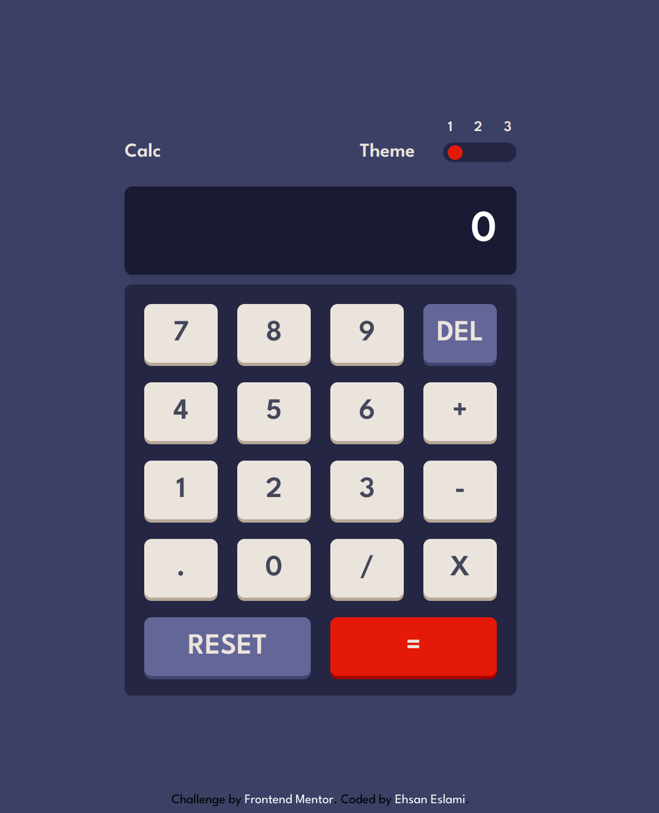

# Frontend Mentor - Calculator app solution

This is a solution to the [Calculator app challenge on Frontend Mentor](https://www.frontendmentor.io/challenges/calculator-app-9lteq5N29). Frontend Mentor challenges help you improve your coding skills by building realistic projects. 

## Table of contents

- [Overview](#overview)
  - [The challenge](#the-challenge)
  - [Screenshot](#screenshot)
  - [Links](#links)
- [My process](#my-process)
  - [Built with](#built-with)
  - [What I learned](#what-i-learned)
  - [Continued development](#continued-development)
- [Author](#author)


## Overview

This project is a modern web-based calculator built using Next.js, TypeScript, and Tailwind CSS. It offers a clean and user-friendly interface with the added functionality of theme customization, allowing users to choose from three distinct themes. This enhances user experience by providing visual variety and personalization options.

### The challenge

Users should be able to:

- See the size of the elements adjust based on their device's screen size
- Perform mathmatical operations like addition, subtraction, multiplication, and division
- Adjust the color theme based on their preference
- **Bonus**: Have their initial theme preference checked using `prefers-color-scheme` and have any additional changes saved in the browser

### Screenshot



### Links

- Solution URL: [Solution URL](https://github.com/Ehsan-eslami/next-calculator-app)
- Live Site URL: [Live site URL](https://next-calculator-app-six.vercel.app/)

## My process

### Built with
- Next.js:
Server-side rendering for better performance and SEO.
Static site generation for improved load times.
API routes for any necessary backend logic.

- TypeScript:
Strongly-typed JavaScript ensuring type safety and reducing runtime errors.
Enhanced developer experience with better code completion and refactoring capabilities.

- Tailwind CSS:
Utility-first CSS framework for rapid UI development.
Customizable and responsive design out of the box.
Easy theming capabilities through configuration.

### What I learned

1. Next.js
- Server-Side Rendering (SSR): Gained a deep understanding of how SSR works and its benefits for performance and SEO.

2. TypeScript
- Type Safety: Appreciated the benefits of using TypeScript for catching errors early in the development process.
- Advanced Types: Became proficient in using advanced TypeScript features such as generics, enums, and type unions.

3. Tailwind CSS
- Utility-First CSS: Embraced the utility-first approach to quickly style components without leaving the HTML.
- Custom Theming: Learned to customize the Tailwind configuration to create and apply different themes efficiently.
- Responsive Design: Developed skills in building responsive interfaces that work well across various device sizes.

4. React
- Component-Based Architecture: Enhanced my understanding of breaking down the UI into reusable components.
- State Management: Used React’s useState hook to manage local state for both the calculator logic and theme selection.

5. Problem-Solving and Debugging
- Debugging Tools: Became more adept at using browser developer tools and debugging techniques to troubleshoot issues.
- Error Handling: Learned to handle errors gracefully, providing meaningful feedback to users.

### Continued development
I want continue working on Themeprovider and css file that becomes easier and nicer

### Useful resources

- [Example resource 1](https://www.example.com) - This helped me for XYZ reason. I really liked this pattern and will use it going forward.
- [Example resource 2](https://www.example.com) - This is an amazing article which helped me finally 

## Author

- Website - [Ehsan Eslami](https://linktr.ee/Ehsaneslami)
- Frontend Mentor - [@Ehsan-eslami](https://www.frontendmentor.io/profile/Ehsan-eslami)


<!----------------------------next.js readme----------------------------->
This is a [Next.js](https://nextjs.org/) project bootstrapped with [`create-next-app`](https://github.com/vercel/next.js/tree/canary/packages/create-next-app).

## Getting Started

First, run the development server:

```bash
npm run dev
# or
yarn dev
# or
pnpm dev
# or
bun dev
```

Open [http://localhost:3000](http://localhost:3000) with your browser to see the result.

You can start editing the page by modifying `app/page.tsx`. The page auto-updates as you edit the file.

This project uses [`next/font`](https://nextjs.org/docs/basic-features/font-optimization) to automatically optimize and load Inter, a custom Google Font.

## Learn More

To learn more about Next.js, take a look at the following resources:

- [Next.js Documentation](https://nextjs.org/docs) - learn about Next.js features and API.
- [Learn Next.js](https://nextjs.org/learn) - an interactive Next.js tutorial.

You can check out [the Next.js GitHub repository](https://github.com/vercel/next.js/) - your feedback and contributions are welcome!

## Deploy on Vercel

The easiest way to deploy your Next.js app is to use the [Vercel Platform](https://vercel.com/new?utm_medium=default-template&filter=next.js&utm_source=create-next-app&utm_campaign=create-next-app-readme) from the creators of Next.js.

Check out our [Next.js deployment documentation](https://nextjs.org/docs/deployment) for more details.
